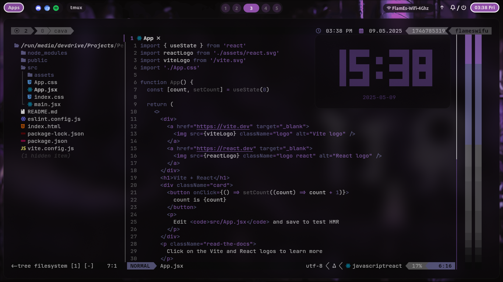
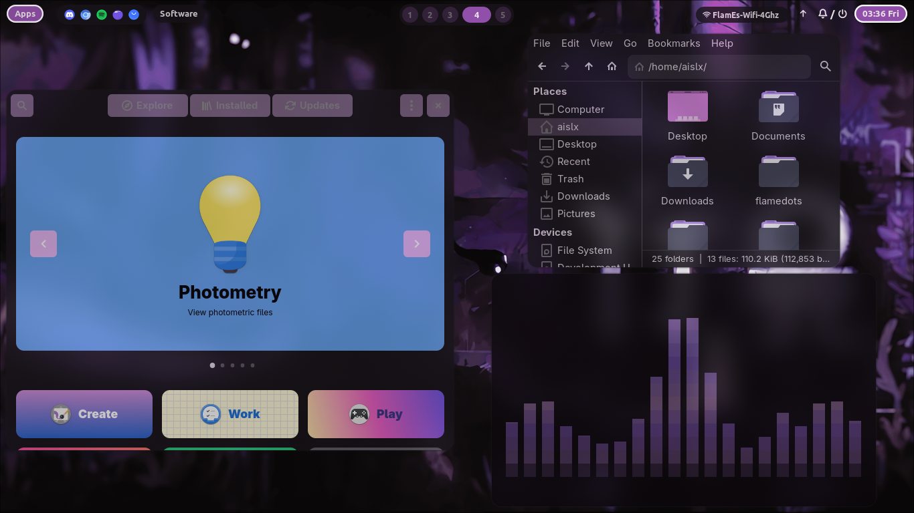
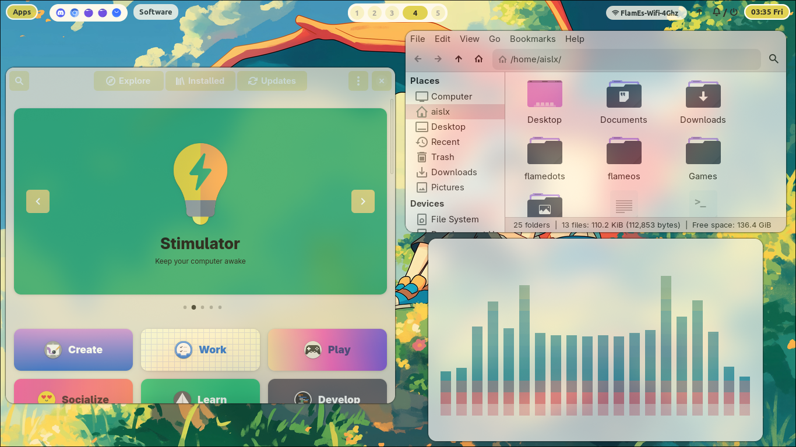

<h1 align="center">🔥 The Flamedots - Elegant Dotfiles for Hyprland</h1>

<p align="center">
  
  
  

</p>

<p align="center">
  <b>Aesthetic. Fast. Custom.</b><br>
  Personal dotfiles tailored for Hyprland window manager with Zsh, SDDM, GTK theming, and more.
</p>

---

## 🌑 Features

- 🪟 Beautiful Hyprland setup with custom animations  
- 🧠 Preconfigured Zsh with powerlevel10k and plugins  
- 🖌️ Dark GTK theme for a uniform look  
- 🎯 SDDM theming and login customization  
- 🛠️ Easy setup script for quick deployment  

---

## 🚀 Installation

> **Note:** These dotfiles are intended for Arch Linux with the [Hyprland](https://github.com/hyprwm/Hyprland) compositor.

### 1. Clone the repository
```bash
git clone https://github.com/aislxflames/flamedots.git ~/flamedots
cd ~/flamedots
```
### 2. Install the dotfiles
```bash
chmod +x build.sh
./build.sh
```
